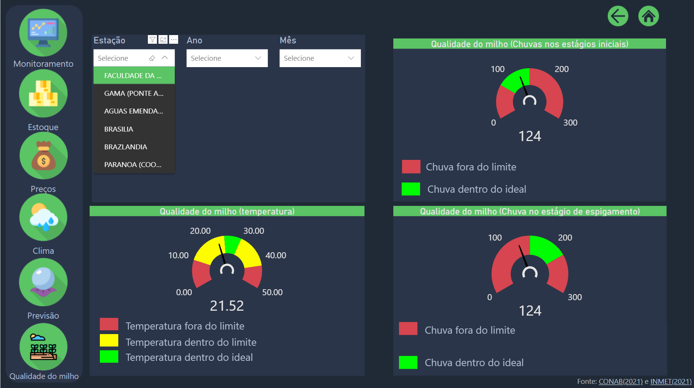

# TCC-Dashboard

#### Criação de um *dashboard* para análise de dados agronômicos e climáticos na produção agrícola de milho no Distrito Federal
Segundo o _ipcc_, o impacto climático agravou-se de tal forma que alguns impactos são inevitáveis. Preparações são necessárias, pois estas mudanças serão sem precedentes e eventos extremos serão cada vez mais frequentes. Um dos vários negócios afetados é o agronegócio. Diante disso, surge o _BI_ como uma forma de analisar o impacto no setor do agronegócio, mais especificamente na produção de grãos. Neste trabalho será apresentado um protótipo  de _dashboard_ para analisar dados agronômicos e climáticos na produção de grãos no Distrito Federal para auxiliar na tomada de decisão das entidades públicas. Utilizando dados públicos, foi criado um _Data Warehouse_ para relacionar dados agronômicos e climáticos, para ser utilizado no protótipo de _dashboard_, desenvolvido utilizando a ferramenta Power BI para visualização de indicadores climáticos.

Neste repositório é apresentado brevemente alguns paineis obtidos utilizando a ferramenta [Power BI](https://powerbi.microsoft.com/).

## Fonte de dados
- [CONAB] - Companhia Nacional de Abastecimento
- [INMET] - Instituto Nacional de Meteorologia
- [CEPEA] - Centro de Estudos Avançados em Economia Aplicada
- [INPE] - Instituto Nacional de Pesquisas Espaciais

## Prévia dos painéis
Painel inicial

Painel de monitoramento que possui uma visão geral

Painel de estoque

Painel de preço 

Painel de precipitação

Painel de previsão

Painel de qualidade do milho

## Autores
- [gbritom]( https://github.com/gbritom ) 
- [kaioribeiro97]( https://github.com/kaioribeiro97 )

[CONAB]:<https://portaldeinformacoes.conab.gov.br/download-arquivos.html>
[INMET]:<https://portal.inmet.gov.br/dadoshistoricos>
[CEPEA]:<https://queimadas.dgi.inpe.br/queimadas/bdqueimadas\#exportar-dados>
[INPE]:<https://www.cepea.esalq.usp.br/br/indicador/milho.aspx>
