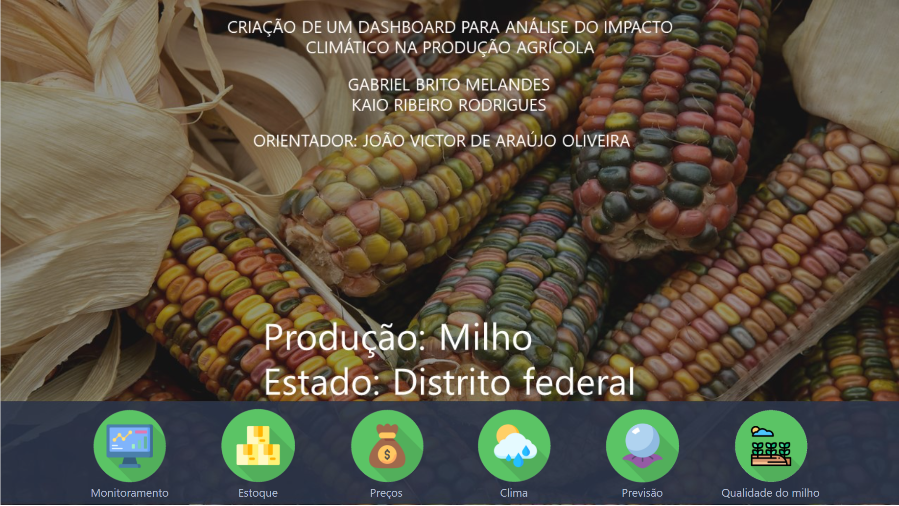
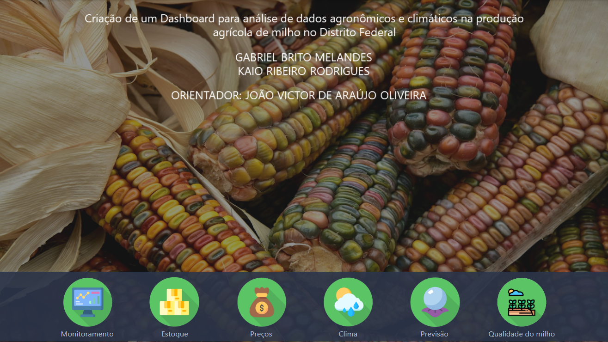
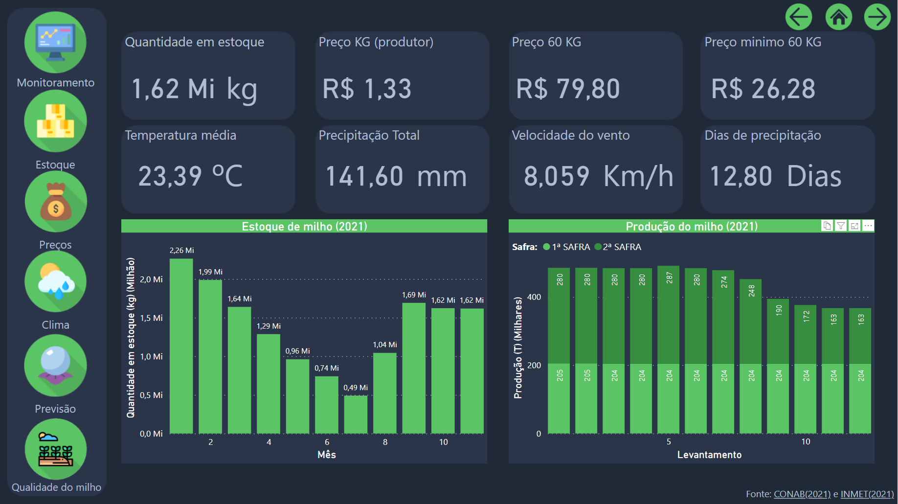
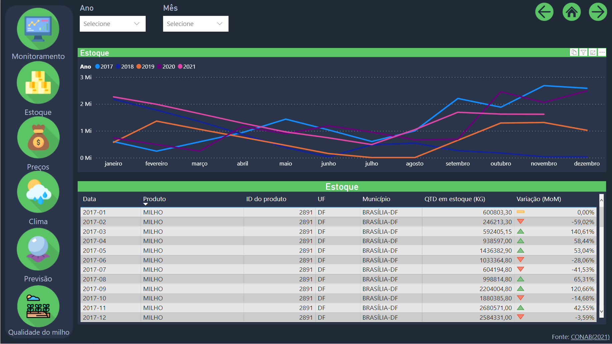
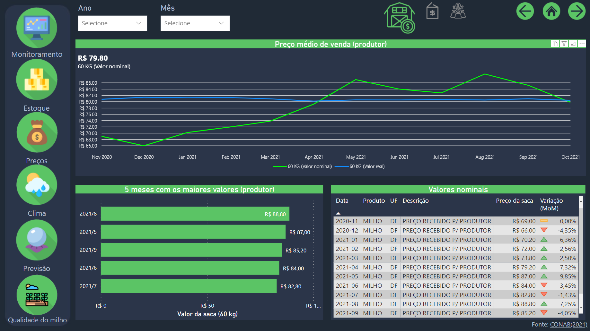
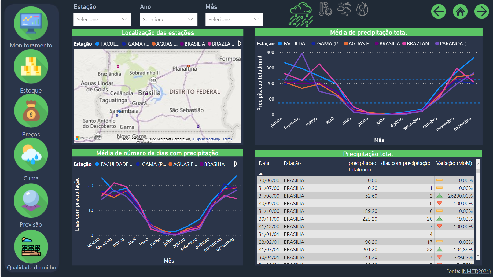
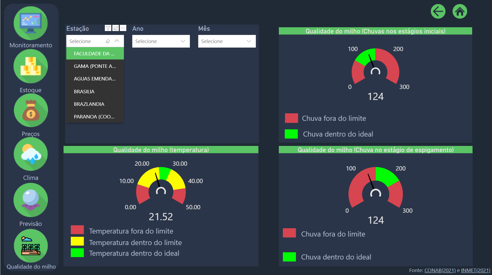

# TCC-Dashboard

**Criação de um *dashboard* para análise de dados agronômicos e climáticos na produção agrícola de milho no Distrito Federal**

Neste repositório é apresentado brevemente alguns paineis obtidos utilizando a ferramenta <url=https://powerbi.microsoft.com/>Power BI</url>.

## Fonte de dados
- [CONAB] - Companhia Nacional de Abastecimento
- [INMET] - Instituto Nacional de Meteorologia
- [CEPEA] - Centro de Estudos Avançados em Economia Aplicada
- [INPE] - Instituto Nacional de Pesquisas Espaciais

## Prévia dos painéis 

## Autores
- [gbritom]( https://github.com/gbritom ) 
- [kaioribeiro97]( https://github.com/kaioribeiro97 )

[CONAB]:<https://portaldeinformacoes.conab.gov.br/download-arquivos.html>
[INMET]:<https://portal.inmet.gov.br/dadoshistoricos>
[CEPEA]:<https://queimadas.dgi.inpe.br/queimadas/bdqueimadas\#exportar-dados>
[INPE]:<https://www.cepea.esalq.usp.br/br/indicador/milho.aspx>
